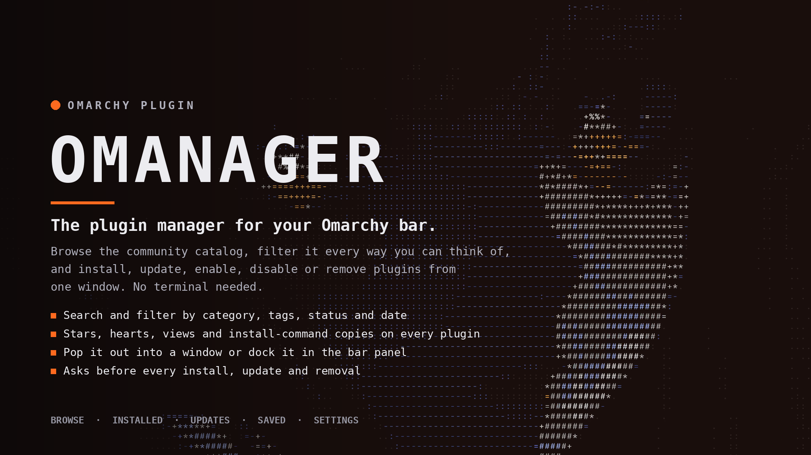

# Omanager

A plugin manager for the Omarchy bar. Click the bar button and a window opens; click it again (or press `Esc`) and it closes. Browse the community catalog, filter it every way you can think of, and install, update, enable, disable, or remove plugins without touching a terminal.



## Features

- **Tabs**: Browse, Installed, Updates (with *Update all*), Saved, Settings.
- **Stats**: stars, hearts, views, and install-command copies show on every card, list row, and compact row, and in the detail / stage pane.
- **Sort**:
  - newly uploaded
  - **as listed** (the exact order the catalog feed returns them in — matches the website's default view)
  - recently upgraded
  - **new or upgraded** (whichever is most recent)
  - most hearts
  - stars
  - views
  - best install rate
  - A to Z
- **Filters**:
  - community / built-in / all
  - category
  - tags (several at once)
  - verified only
  - hide installed
  - status (installed, not installed, has update, saved, new since your last visit)
  - time window (week, month, 3 months, year) that looks at uploads, upgrades, or either

  The **Uploaded / Upgraded / Either** chips are dimmed until a time window is chosen because they only apply to it.

- **Search** across names, IDs, authors, categories, tags, and descriptions.
- **Pop out / dock**:
  - The header's *Pop out* button turns the manager into a real window you can move, resize, and tile.
  - *Dock* puts it back into the bar panel.
  - Filters, selection, and search survive the switch.
  - **Settings > Window > Open as** picks which one the bar button opens first.
- **Layouts**:
  - *List + stage* — default: compact list on the left, a large preview with actions for the selected plugin on the right.
  - *Cards* — 1 to 4 columns or automatic.
  - *List* — plain list.
  - *Compact* — a dense, table-like view with one plugin per row: name, category, author, stats, status, upload age, and install button.

  Previews come from the catalog's own thumbnails and full-size images. Compact skips them entirely, so it stays fast on large catalogs.

  Cycle with the header's layout button, or pick one in **Settings > Window > Layout**.

- **Colors**:
  - follow the bar theme
  - your own accent color
  - monochrome
  - a different tint per category

  Plus card style, spacing, roundness, text size, and window tint.

- **35 settings**, grouped into:
  - Appearance
  - Window
  - Browse
  - Catalog
  - Safety
  - Bar

  Settings are searchable, written in plain language, and have a reset arrow for anything you changed.

- **Safety**:
  - confirmation before install / update / remove
  - optional block on unverified plugins
  - commands run as argument lists (never through a shell)
  - repository addresses must be plain HTTPS GitHub / GitLab / Codeberg repositories

- **Offline support**: works offline from a cached catalog and keeps bookmarks and your last visit.
- **Fast refresh**: the catalog is requested compressed and conditionally, so an unchanged catalog is a tiny `304` instead of a multi-megabyte download. Hearts, views, and copies come from the marketplace's separate stats API.

## Install

```bash
omarchy plugin add https://github.com/qempexe/omarchy-omanager.git --enable
```

Or from a local copy:

```bash
mkdir -p ~/.config/omarchy/plugins/io.github.qempexe.omanager
cp -r ./. ~/.config/omarchy/plugins/io.github.qempexe.omanager/
omarchy plugin validate ~/.config/omarchy/plugins/io.github.qempexe.omanager
omarchy plugin enable io.github.qempexe.omanager --section right
```

Requires `curl` (catalog download) and `wl-copy` (only for "Copy install command").

### Floating the Pop-out Window (Hyprland)

Hyprland tiles new windows. To make the popped-out manager float and center, match its title (a Quickshell toplevel always has the class `org.quickshell`).

In `~/.config/hypr/hyprland.lua`, following the style Omarchy uses:

```lua
o.window({ class = "^org\\.quickshell$", title = "^Omanager$" }, { tag = "+omanager-window" })
o.window({ tag = "omanager-window" }, { float = true })
o.window({ tag = "omanager-window" }, { center = true })
o.window({ tag = "omanager-window" }, { size = { 1180, 760 } })
```

Without rules it still works; it just tiles like any other window.

## Settings

Everything is in the window's **Settings** tab (or by right-clicking the bar button).

Each change is applied instantly, saved locally, and mirrored to `omarchy bar set`.

The list lives in `tools/gen.py`. Edit it, run:

```bash
python3 tools/gen.py
```

Then `manifest.json`, `Schema.js`, and the settings block of `BarWidget.qml` are regenerated together.

## Shell Commands

```bash
omarchy-shell shell summon io.github.qempexe.omanager   # open the window
omarchy-shell shell hide io.github.qempexe.omanager     # close it
omarchy-shell io.github.qempexe.omanager refresh        # re-download the catalog
omarchy-shell io.github.qempexe.omanager status         # JSON: catalog, updates, activity
```

## How It Works

```text
Service.qml    catalog download + cache, `omarchy plugin list --json`, action queue
Model.js       normalising, filtering, sorting, URL/command safety (unit-tested)
BarWidget.qml  bar button, settings, owns UiState, decides panel vs window
UiState.qml    all window state (filters, selection, theme helpers, results)
ManagerView    the whole UI; shown by Panel.qml (bar panel) or PopoutWindow.qml
ResultsView    the scrolling grid / list / compact table + empty states
PluginCard     one plugin in card, list, or compact form
```

## Tests

```bash
node tests/test_model.js        # catalog parsing, filters, sorts, command safety
python3 tests/test_manifest.py  # manifest / Schema.js / QML drift, plain-text rule
```

## Changelog

### 1.2.0

- **Pop-out matches the bar.** The pop-out window and the bar panel now paint the same opaque surface, taken from the bar's own background colour. Before, the pop-out used a neutral grey derived from the foreground, so the two looked different.
- **Colors that read on any bar.** Text falls back to black or white when the bar's foreground is too close to its background.
- **Status colours on light themes.** Verified, update, and warning colours use darker variants on light surfaces. Before, the pastel versions were hard to read.
- **Selected chips and tabs.** Labels pick black or white against the fill, so they stay readable with any accent colour, including light custom colours.
- **By category** picks tone lightness from the actual surface, so the hues stay legible on light and dark bars.
- **Monochrome** is truly grey. Surfaces and text use only black, white and greys, with no tint from the bar's colours.

### 1.1.0

- Fixed **"Newly uploaded"**: the listing date (`listedAt`) is now preferred over the internal `addedAt` timestamp, so the ordering matches the website's **RECENTLY ADDED** view.
- Added a new **As listed** sort option that preserves the raw catalog order as a guaranteed fallback.
- Added a **Compact** layout: a dense, table-like view of the whole catalog with one plugin per row:
  - category dot
  - name
  - category
  - author
  - stats
  - status badges
  - upload age
  - saved star
  - install button
- Compact can be selected from the header's layout button or **Settings > Window > Layout**.
- The filter and sort pipeline is unchanged, so the Compact view shows exactly the same set of plugins as the other layouts.

### 1.0.0

- First release.

## Status

The logic in `Model.js` and the manifest/QML consistency are covered by the tests.

The bar widget has been loaded in a live shell; the window, the pop-out, and the layouts have not been run there yet.

Things that are inferred rather than confirmed:

- **Catalog fields**: previews use `previewThumbnail` / `previewImage`, and the listing date reads `listedAt` first (falling back to `addedAt`, `createdAt`, and several other spellings) so the "Newly uploaded" order matches the website.
- **Last upgraded date**: reads `repositoryUpdatedAt` first, then several other spellings. If "Upgraded" shows "unknown" or looks wrong, adjust the alias list in `normalizePlugin`.
- **Stats API response shape**: `api.omarchyplugins.com/v1/stats` accepts several shapes. If none matches, hearts / views simply stay empty.
- **`FloatingWindow`**: the pop-out comes from Quickshell. It is used by other Omarchy plugins but has not been run here.
- **CLI flags**: the `--yes` flags on `plugin add` / `plugin remove` and the `plugin enable|disable|update` subcommands are assumed. Remove retries without `--yes` if the first attempt fails.

Run:

```bash
omarchy plugin validate .
qs log -p "$OMARCHY_PATH/shell" --tail 100
```

first if something looks off.

### If Clicking the Bar Button Shows Nothing

The button now logs why and never silently does nothing.

If the bar panel fails to load or does not open within about half a second, the manager opens as its own window instead.

Look in `qs log` for lines starting with `Omanager:`:

```text
Omanager: Panel.qml failed to load
Omanager: the panel did not open
```

Panel sizing no longer depends on the shell's `Style.space` / `fittedContentWidth` helpers existing.

To always use the window, set **Settings > Window > Open as** to **Own window**.

## License

MIT